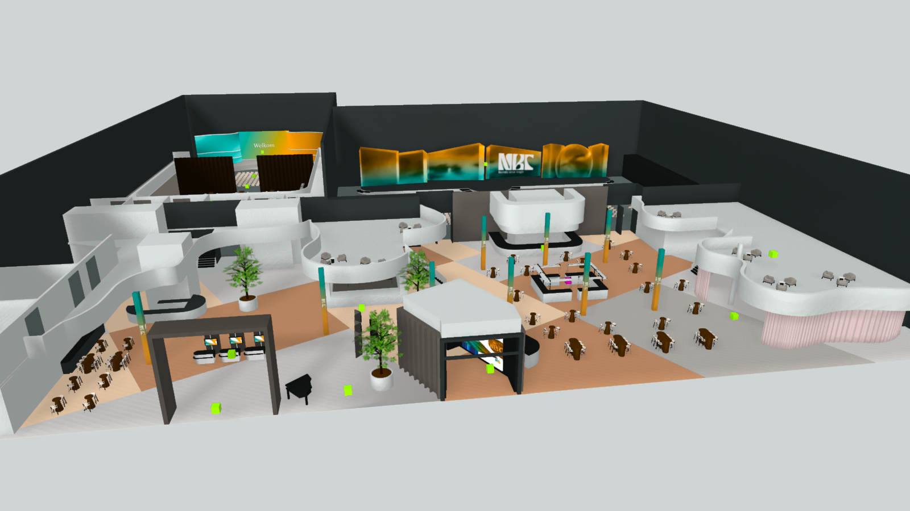
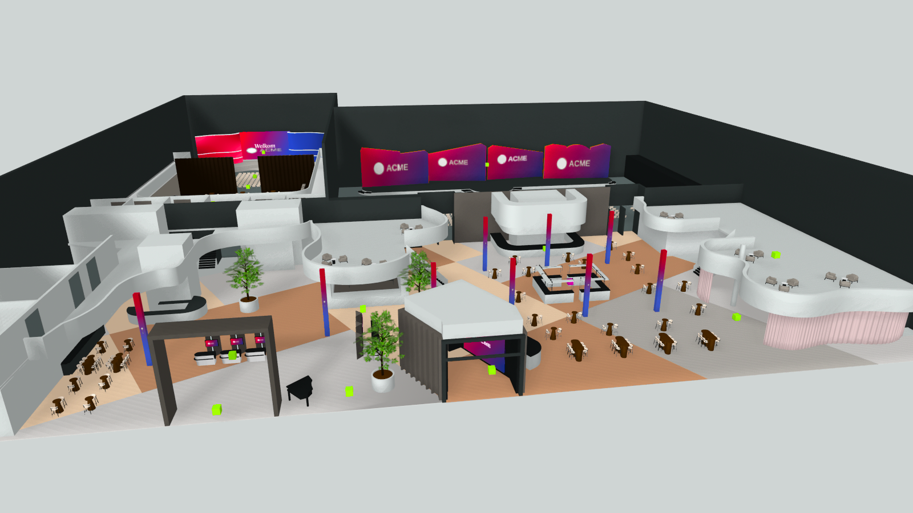
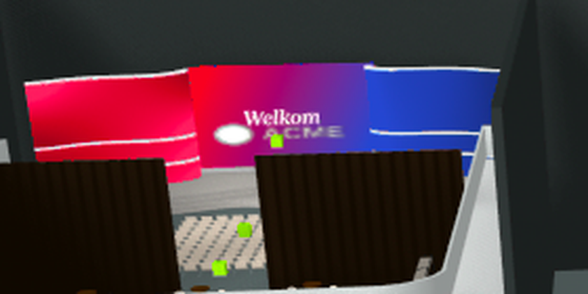

# NBC Events — 3D plattegrond voor sales

Doorontwikkeling van de 3D plattegrond (nbcevents.nl/3d-plattegrond) tot
salestool: per event een gebrand 3D-model met eigen logo, huisstijlkleuren en
schermcontent, deelbaar via een unieke, niet-herleidbare URL.

**Status: werkend proof-of-concept.**

- Alle schermen in het model (groot scherm Event Hall, LED-wall entree,
  registratie-/narrowcastingschermen, LED-pilaren) zijn runtime te vervangen
  door een geüpload beeld of een gegenereerde huisstijl-afbeelding.
- Het **kleurverloop op de 9 LED-pilaren** en het **projectiescherm in de
  Grand Hall** wordt omgezet naar de 2 huisstijlkleuren (verloop en
  licht/donker-variatie blijven behouden), met het geüploade logo op het
  Grand Hall-scherm op de plek van het NBC-logo.
- **Opstelling kiezen** (Congres / Feest / Sit-down dinner) en per hal de
  opstelling **aan/uit zetten**: Event Hall- en Grand Hall-opstellingen
  (stoelen, barren, tafels) zijn per event te verbergen.

| Origineel | Gebrand (testmerk "ACME") |
|---|---|
|  |  |



## Onderdelen

| Pad | Wat |
|---|---|
| `assets/spline/*/scene.splinecode` | De 4 Spline-scènes van de live site (congres, feest, sitdown, lounge) |
| `src/branding.js` | Branding-module: texture-injectie + kleuren, werkt op `@splinetool/runtime` |
| `viewer/` | Klantpagina: laadt branding-config via `?e=TOKEN` of `#c=<config>` en toont het gebrande model |
| `admin/` | Demo-beheeromgeving: kleuren kiezen, logo/beelden uploaden, deelbare link genereren |
| `scripts/` | Lokale server + Playwright-testen (inspectie, branding-PoC, viewer e2e) |
| `docs/architectuur-analyse.md` | Technische analyse van de bestaande tool |

## Lokaal draaien

```bash
npm install
node scripts/serve.mjs        # http://127.0.0.1:8787
# open /admin/  → branding samenstellen, voorbeeld + deelbare link
# open /viewer/ → kaal model
```

Testen (headless Chromium; in een omgeving zonder internet worden de
draco/wasm-verzoeken lokaal afgevangen):

```bash
node scripts/test-branding.mjs congres   # before/after-screenshots branding
node scripts/test-viewer.mjs             # e2e: viewer met config + scènewissel
node scripts/inspect-scene.mjs           # inventarisatie objecten/materialen
```

## Hoe de branding werkt

De Spline-runtime bewaart alle scène-afbeeldingen in
`app._sharedAssetsManager.imageHolderCache`. Elke holder heeft een naam
(bijv. `Event Hall Scherm - Deel 1_2-8.png`) en de live THREE-textures in
`holder._cache`. `src/branding.js` herkent schermgroepen op asset-naam
(zie `SCREEN_ROLES`), vervangt de afbeelding in-place en zet `needsUpdate`
— elk object dat de asset gebruikt verandert mee.

Daarnaast:
- **Kleurverloop-recolor**: gradient-lagen in de Spline-materialen (o.a.
  pilaren en Grand Hall-scherm) hebben stops als vec4-uniforms
  (`layer.uniforms.fN_colors`). Alle tinten uit de NBC teal-familie gaan op
  hue naar kleur 1, de oranje-familie naar kleur 2, met behoud van de
  lichtheid per stop zodat het verloop diepte houdt. Egale kleurlagen worden
  alleen bij exacte NBC-kleuren vervangen (meubels blijven ongemoeid).
- **Logo op het Grand Hall-scherm**: nieuwe meshes rendert de Spline-pipeline
  niet (gecachte renderlijst), dus verplaatst `overlayLogoOnGrandHall` een
  bestaand pilaar-logovlak (het vlak dat tegen de achterwand kijkt, dus
  onzichtbaar) naar het scherm, georiënteerd op de "Welkom"-tekst.
- **Opstellingen aan/uit**: elke scène heeft een groep `Opstellingen > <mode>`
  met per hal een subgroep (`Event Hall`, `Grand Hall`, `GH - Feest`,
  `Sit down dinner (2)`, `Hosp1/2`). `setHallVisibility` zet daar `visible`
  op false; mapping in `HALL_GROUP_NAMES`.

Deel-URL's: `viewer/?e=TOKEN` laadt `configs/TOKEN.json` (token = 22 random
tekens, niet herleidbaar tot de klant). Voor snelle demo's zonder server kan
de volledige config ook in de URL-hash (`#c=…`).

## Nog te doen (zie wensendocument)

- Fijnere opstellingsvarianten (half/half, theater groot/klein, wand erin/eruit)
  — vergt nieuwe varianten in de Spline-editor
- Hospitality-area's aan/uit in de beheeromgeving (module ondersteunt het al:
  `halls: { hosp1, hosp2 }`)
- Lichtbeams/LED-lijnen rond deuren in huisstijlkleur
- Entresol-bestickering, traptreden, zaalbordjes, extra groen
- Beheeromgeving met login + server-side opslag van configs en uploads
- Integratie in de bestaande site/CMS (config injecteren naast `REACT_THREE_CONFIG`)
